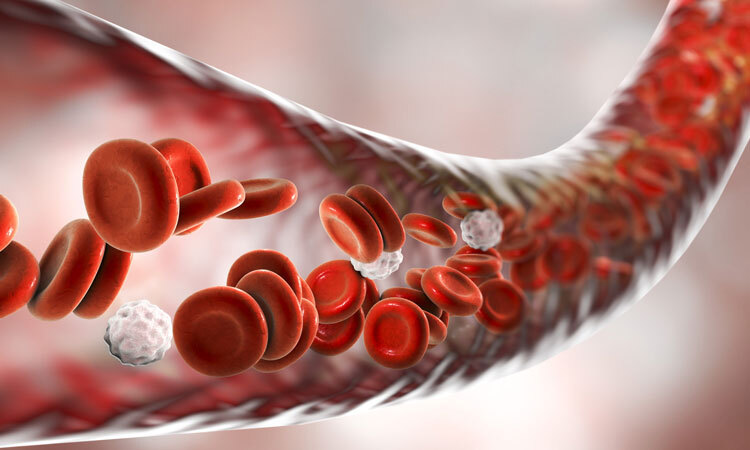
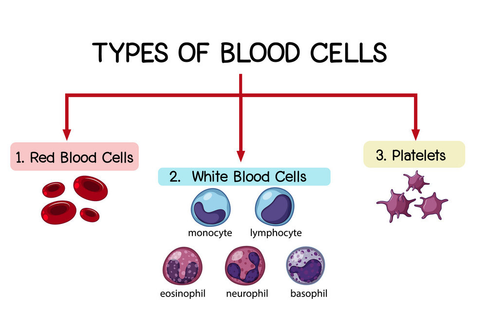
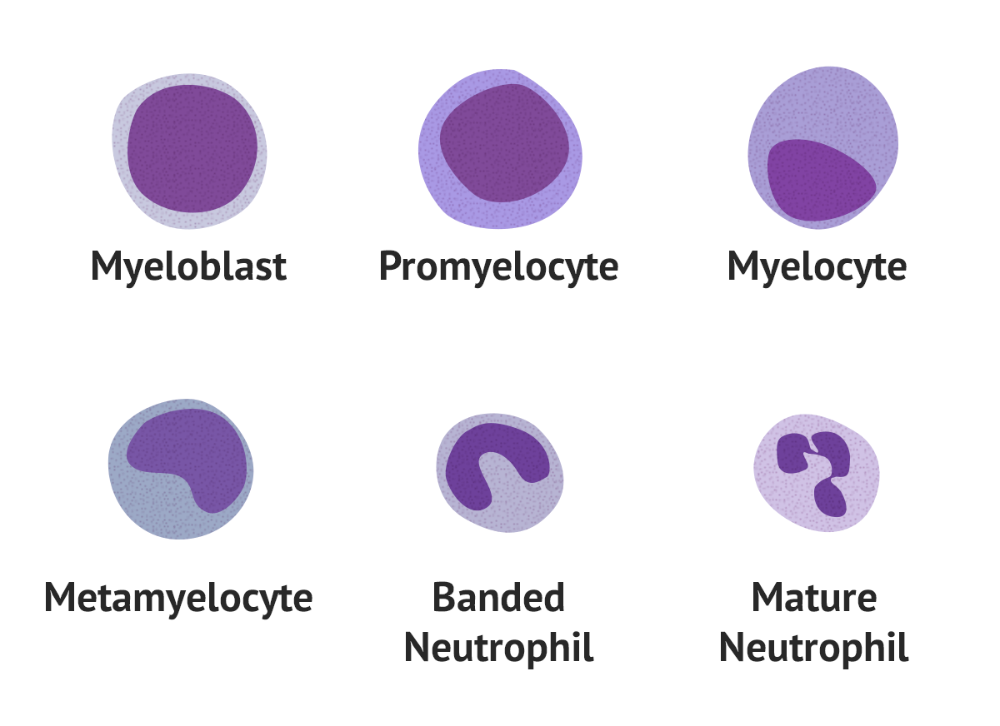

# BloodySpy  <h6><em> - Blood cells categorization</em></h6>



<br/>

## Introduction

Blood is an essential element for human survival. It allows the supply of oxygen and nutrients to the organs, blood coagulation but also the immune defenses transport against bacterial and viral attacks. Blood contains several cell types that perform these functions. Thus the appareance of disturbances in blood composition is a good marker of pathologies presence.

Today hematological diseases are diagnosed in more than 80% of cases thanks to quantitative and qualitative analyzes of the different cell types. However, the morphological differentiation of normal and abnormal blood cell types is a difficult task requiring significant expertise. In order to overcome the lack of expertise in certain medical circles, the creation of auto diagnostic models of human blood pathologies would therefore be an interesting tool to explore. Therefore this project consists of developing computer vision models capable of identifying the different types of blood cells through the analysis of human blood cells collected by blood smears. The training of these models will be carried out on a database of blood cells from healthy subjects.

### Blood cell types description

<table border="0">
 <colgroup>
    <col span="1" style="width: 50%;">
    <col span="1" style="width: 50%;">
 </colgroup>
 <tr>
   <td></td>
  <td>
   <td></td>
  </td>
 </tr>
</table>
<br/>
<!-- 
 -->

Peripheral blood contains three main cell types : the **erythrocytes (red blood cells)** which are responsible of the transport of oxygen to the organs, the **thrombocytes (platelets)** allowing blood coagulation and the **leukocytes(white blood cells)** protecting the body against viral and bacterial invasions. The differentiation of those cell types is possible by morphological analyses thanks to specific coloration methods like the  May-Grün coloration.

From a structural point of view, the leucocytes can be subdivided into three major classes : the **granulocytes**, the **lymphocytes** and the **monocytes**. The class of granulocytes itself includes several subtypes according to their coloration: the **neutrophil** granulocytes, the **eosinophilic** granulocytes and the **basophilic** granulocytes.

During disease onset, it is also possible to find **immature granulocytes** that contain the classes of myeloblast, promyelocyte, myelocyte and metamyelocyte. Usually they are in the spinal bone but a presence of a high level of those cells in the blood could be the sign of a cancer. That's why their detection and their quantification in the blood are important for disease diagnosis.

<br/>

## Links

 - [*Access to dataset*](https://data.mendeley.com/datasets/snkd93bnjr/1)
 - [*Access to article*](https://www.sciencedirect.com/science/article/abs/pii/S0169260719303578?via%3Dihub)

<br/>

## Fast API App
There are different ways to launch the app.
The most recommended way will be the last one presented here, which will automatically pull the image from Docker Hub and run a Docker container.

<br/>

<!-- ### Directly from this repository -->
**Locally**

It is advised to create a virtual environment before running the application.

```shell
git clone https://github.com/paultessier/bloodyspy
cd bloodyspy
virtualenv env
source env/bin/activate
pip install -r requirements.txt
uvicorn app:api --port 8001
```

The app should then be available at this [link](http://localhost:8001/docs).

<br/>

**Docker build**

You can also run the Fast API app in a [docker](https://www.docker.com/) container. To do so, you will first need to build the Docker image :

```shell
git clone https://github.com/paultessier/bloodyspy
cd bloodyspy
docker build -t bloodyspy:1.0.0 .
docker run --it --rm -d --name bloodyspy -p 8002:8000 bloodyspy:1.0.0
```

The app should then be available at this [link](http://localhost:8002/docs).

<br/>

**Docker compose**

You can also download the image from [Docker Hub](https://hub.docker.com/). It will automatically be pulled from [there](https://hub.docker.com/repository/docker/paultessier/bloodyspy/tags) by running the [docker-compose](docker-compose.yml) file.
However, you need to build 2 other images ([curl-test](tests/curl) and [py-test](tests/python)) before, which will test the api end points.

```shell
git clone https://github.com/paultessier/bloodyspy
cd bloodyspy
docker build -t bloodyspy:curl_test ./tests/curl
docker build -t bloodyspy:py_test ./tests/python
docker-compose up
```

The app should then be available at this [link](http://localhost:8000/docs).

<br/>

**Docker hub (mostly recommended)**

By running the simple command below, the image will be automatically pulled from [Docker Hub](https://hub.docker.com/repository/docker/paultessier/bloodyspy/tags).

```shell
docker run --it --rm -d --name bloodyspy -p 8003:8000 paultessier/bloodyspy:1.0.0
```

The app should then be available at this [link](http://localhost:8003/docs).

<br/>

## Author

Paul TESSIER
[](https://github.com/paultessier)  [](https://www.linkedin.com/in/p4ul-tessier/)